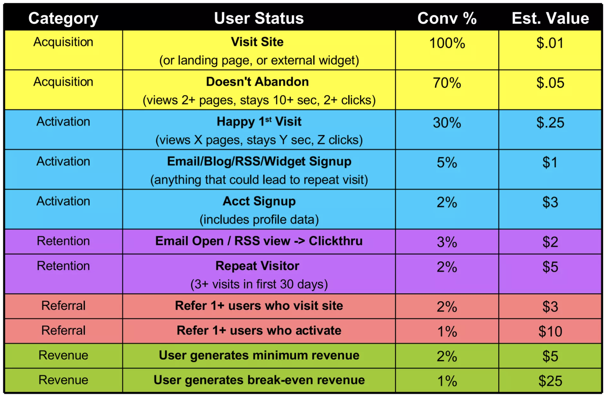

# Metrics {#sec-metrics}

todo
- Look at: https://www.statsig.com/blog/picking-metrics-101

## Why good metrics matter

- Good metrics ensure that everyone works towards the same goal in a way that is reliable, transparent, and provides accountability -- they ensure coherence across the company.

- Good metrics increase the probability that our evaluations detect a change if there is one -- they have high sensitivity.

## Metric taxonomy

- Different contributions in the literature and different companies use different ways to classify metrics. So so the same type of metrics will have different names and the same name will be used for different types of metrics across contexts. What matters is less the labels, but an understanding of the different functions metric can serve and how different types of metric relate to one another.

- @kohavi2020trustworthy classify metrics into goal metrics, driver metrics, and guardrail metrics. I find this useful and use it as the basis of how I think about metrics, but also add supporting and debug metrics.

- While I talk about these metrics below mainly as defined at the company level, they can be defined at each level within an organisation. 

- The challenge is to make sure that definitions across metric types and organisation levels cohere. Figure 6.1 in @kohavi2020trustworthy is a useful way to visualise this: it shows a large arrow containing many small arrows inside. This can represent goal metrics (large arrow) and driver metrics (small arrows) or organisational metrics (large arrows) and team metrics (small arrows). In each case, we want to make sure that the direction of the small arrows is as aligned as possible with the large arrow.

{width=75%}

### Goal metrics

- Also "success metrics" or "North Star" metrics

- Directly aligned with the organisation's mission and represents how it creates value for its customers

- They are a quantitative definition of what success looks like

- Tend to be long-term oriented and slow-moving

- An organisation usually has only very few or even just one

- Examples: "average monthly purchases" for Amazon, MAP for Meta

### Driver metrics

- Also "surrogate metrics", "predictive metrics", "proxy metrics"

- Capture the movement of factors contributing to the organisation's goal

- They are a quantitative representation of what drives success

- They tend to be short-term oriented and fast-moving 

- Will change over time as the service matures and as it becomes more closely aligned/correlated with the North Star

- @duan2021online discuss lots of useful considerations for cases where we run experiments based on surrogate metrics

- Example for Amazon buyer focused team: number of high-quality sellers that join platform per month.

### Guardrail metrics

- @kohavi2020trustworthy divide guardrails into two types: those protecting the business and those ensuring internal validity of experiment results

- The main guardrail to ensure internal validity is smaple ratio mismatch (SRM). Others are discussed in chapter 21 in @kohavi2020trustworthy

- Guardrails that protect the business ensure that improving one part of the platform don't come at the cost of quality/experience/something else -- they basically try to guard against unintended consequences (an example would be site latency, but could also be cross-pillar effects such as when a change to customer experience affects restaurant metrics)

- @deng2016data argue that the main feature of a good guardrail metric should be directionality, so that we can be sure that if we get a signal, it points in the right direction in terms of user experience (in contrast to debug metrics, which should have good sensitivity)

- Amazon example: average number of purchases per day (to check that influx of sellers doesn't lead to paralysis for buysers)

### Supporting metrics

- Indicators that the primary or NS metric are moving in the right direction (particularly useful as leading indicators)

- Amazon example: emails sent to high-quality sellers, emails opened, etc.

### Debug metrics

- @deng2016data mention debug metrics as a way to get additional informaiton about the movement of our primary metrics.

- They can be useful when showing the individual components of combo metrics, or the numerator and denominator of ratio metrics.

## What makes a good Metric

- What makes a good metric in general varies of the type of matric we're talking about.

- @kohavi2020trustworthy argues that a good goal or North Star metric is simple and stable. A good driver metrics, especially one which we would use for experimentation (is there ever an argument to be made for a driver metric that you wouldn't want to use for experimentation?), we have a few more criteria.

- A good starting point to think about characteristics of a good metric for experimentation is the [STEDII framework](https://www.microsoft.com/en-us/research/group/experimentation-platform-exp/articles/stedii-properties-of-a-good-metric/) from Microsoft's experimentation platform. But I find it quite incomplete, and augment it with other measures mentioned in @kohavi2020trustworthy.

Key:

- Meaningful: does it reflect the goal of the company/product (check is direction of change aligned with change in quality)

- Measurable: not everything is measurable (e.g. post-purchase satisfaction)

- Attributable: we must be able to attribute changes in the metrics to experiment variants (not possible with data from third party data proviers)

- Sensitive and timely: ensures we can detect a change in a timely manner (check that metric variance is low, and that we have historically observed change in the metric)

- Trustworthy: is the metric reliable for what we want to measure (is data collection reliable? is it not gameable[^goodhartslaw]?)

- Interpretable and actionable: do we know what a change in the metric means? can we easily interpret it?

- Directionality: does the measure consitently go in the same direction for a change that means the same?

Further conserns:

- Efficient: can we use the metric at scale? (check cost of metric use)

- Debuggable: can we investigate anomalies (can we decompose metric?)

- Inclusive and fair: do we know blindspots and limitations? do we have segments to check impact of most vulnerable segments? 

## Developing and evaluating good metrics

- See @richardson2023pareto for a great paper on how to develop ideal proxy metrics (i.e. metrics that aren't directly the North Star). @duan2021online also seems promising. 

- @deng2016data suggest a three-step process to develop user-behaviour-driven metrics:

  1. Formulate a hypothesis based on a simple model of user behaviour (e.g. social network users who like, comment, and share more have a better user-experience)

  2. Conduct user studies to create labelled data against which the original model can be tested (e.g. conduct user surveys and test whether users who like, comment, and share more report a better experience)

  3. Design online metrics based on insights from step 2 and assess their directionality and sensitivity as discussed below (e.g. create a metric called "meaningful engagement" and test whether it has high directionality and sensitivity in past experiments)

  In doing this, remember to 1) focus on behaviour patterns that are observed for most users, 2) collect labelled data from various sources to mitigate bias (surveys, lab studies, annotated logged data), and 3) use transparent models so that we can define and track debug metrics (e.g. create an online metric using a decision tree, rather than a complex ML model).

- @deng2016data recommend using two criteria to evaluate the quality of a metric: directionality and sensitivity. Directionality requires that a move of the metric in one direction consistently captures the direction of the user experience. In practice, the direction of a metric, such as queries per user can be ambiguous. Sensitivity requires that the metric picks up changes in the user experience such that we can identify it as part of an experiment. We can think of them as the direction and the size of a vector: the more directly it points towards the North Star, and the closer it gets, the better. These two criteria also allow us to qualitatively compare different metrics and decide which one(s) to use as our OEC.

- @deng2016data propose two ways to evaluate directionality and sensitivity. First, we can use a validation corpus: a collection of prior experiments for which we know the effect on user experience, and which we can then use to test sensitivity and directionality of our metrics. The second, if no validation corpus is available, is degeneration experiments, whereby we deliberately degenerate the user experience in a way that is acceptable and doesn't harm long-term user experience, and then measure directionality and sensitivity of the metrics.

- @deng2016data point out that ratio metrics (CTR or Success Query Rate) are often good candidates for OECs because they are bounded and have high sensitivity. However, they need to be interpreted carefully because a change can result from a change in the numerator, the denominator, of both, out of which only the first gives a clear signal. Hence, when relying on ratio metrics, they recommend two things: 1) rely on debug metrics to separately track numerator and denominator, 2) only rely on ratio metrics with a stable denominator. For example: Bing used Session Success Rate instead or Query Success Rate even though QSR was more sensitive because the denominator of SSR was more stable (QSR was used as a debug metric).

- For cases where no single metric fits all scenarios, @deng2016data recommend using a combo metric. To create such a metric, it is important to 1) understand the direction and interpretation of each metric and be aware of the scenarios when it fails to provide an accurate signal, 2) have metrics that cover all scenarios.

- Overall process
  - Define Goals for feature (e.g. improve efficiency)
  - Define Signals (fewer undos or erases)
  - Define Metrics (average number of undos per session)

## Combining metrics into a signal / creating an OEC

- We often consider multiple key metrics, and have a mental model of the trade-offs we are willing to accept (i.e. how much churn are we willing to accept as long as other users compensate for loss)?

- An OEC is a way to formally state these trade-offs by creating a single metric as a weighted average of all key metrics.

- Possible approaches

  - Normalise each metrics to between 0 and 1 and assign a weight to each

## How to select metrics

- NSM -- what is essence of company? How can we capture it?

- Driver metrics

  - In general, want product/service metrics that capture essence/goal/value proposition of product and drive company mission/NSM

  - E.g. for mature product, might wanna focus on engagement rather than activation/growth

  - Is there one single NSM for product/service (i.e. #of txns for Marketplace)

  - Questions to think about

    - How does the product work, exactly? (Do we know if transaction happens?)

    - What is essence of product? (Give everyone opportunity to sell things and help locals find what they need)

    - What are its goals? (Product pretty mature, so maybe engagement rather than growth)

    - What would success look like? (We facilitate a lot of transactions)

    - How do users get value from it? (Sellers sell things quickly, buyers find things quickly)

- Support and guardrails trickier. Use AAAERRR Framework

- To ensure coherence across all workstreams in a company, metrics used at all levels have to contribute to the same overall goal, which is captured by the company's North Star.

- Primary metric something that directly captures what you wanna improve? Guardrails general health metrics you don't want to go down (e.g. revenue, conversion)? Based on Kohavi anecdote below

- @bojinov2020importance mention that LinkedIn has four company wide success metrics and many product specific ones. So, presumably we'd use company-wide ones as guardrails. Question is, what are good product-specific metrics? Good in the sense that they have a positive impact on business-wide metrics? Can use causal inference (e.g. IV) to test effect (see section 2.1 in @bojinov2020importance)

- Have an OEC that directly captuers what you want to measure. Selecting the wrong metric can lead to misleading results. @kohavi2012trusworthy provide a memorable example from an experiment at Bing: the experiment increased revenue by user because search results were poorer, leading users to make more searches and lead them to click on more adds. This is good in the short-term. But in the long term, users will surely get frustrated by the poorer search results. A better metric would have been one that directly captures the quality of the search results, such as sessions per user. Lesson: have an OEC that directly captures the thing you want to improve, and use higher level-metrics such as revenue as guardrails.

- Normalise metrics by sample size. E.g. user revenue per user rather than variant-level revenue (since the latter is dependent on number of users, which can vary between variants).

- Adam D'Angelo on metrics [here](https://www.youtube.com/watch?v=zsBjAuexPq4)

  - What to measure? Focus on users who are getting value today
    - Active users (active if getting value)
    - Revenue (implies they get value)
    - Transactions (for marketplace)

  - In general, if you have two groups, focus on metric that unifies them (i.e. for marketplace, transactions captures value for sellers and buyers)

## Good use of guardrail metrics

- Based on Airbnb's Experiment Guardrail system as discussed in [this](https://medium.com/airbnb-engineering/designing-experimentation-guardrails-ed6a976ec669) post

- Goal is to have an automated process that ensures that no change as a negative impact on another part of the product without there having been an explicit discussion about it

- Select guardrails for each experiement (based on types of guardrails above, and find balance between protecting all teams and moving fast -- remember, as pointed out in the post, if you have 50 guardrail metrics and alert any significant degradation, then you have at least one false alert in 92% percent of experiments -- given that $1 - (1-0.05)^50 = 0.92$)

- For each metric, have three types of guardrals: impact guardrail (catch experiments with high negative impact on metric), power guardrail (ensure impact guardrail has adequate significance and power levels) and stat. sig guardrail (catch even small impacts on key metrics if statsig)

- Experiments that raise a flag are being discussed among all stakeholders to make launch decision considering all trade-offs

### How to think about risks of a given set of metrics?

- Think about what I've focuse on (i.e. engagement for a mature product)

- The risk is then that we neglect stages earlier in the funnel (e.g. acquisition in areas where the product doesn't do as well) and later in the funnel (i.e. we might wanna think about monetisation)

## Frameworks for creating driver metrics

Driver metrics represent quantitative measures of the factors that drive an organisation's success. The following frameworks help us think about those drivers of success.

### Pirate metrics (AARRR)

Developed by Dave McClure, the pirate metrics (summary [here](https://500hats.typepad.com/500blogs/2007/09/startup-metrics.html), slides [here](https://www.slideshare.net/dmc500hats/startup-metrics-for-pirates-long-version)) classify driver metrics into:

- Acquisition (the user comes to our site from various channels)

- Activation (has a good experience on the first visit)

- Retention (comes back to the site)

- Referral (likes the site enough to recommend it to others)

- Revenue (engages in a revenue generating behaviour)

The below Table provides a useful example of possible conversion metrics and associated conversion rates. 

### AAAERRR

An extension of the pirate metrics.

- Awareness (how many aware of product)

- Acquisition (how many use product)

- Activation (how many are realizing value of product -- e.g. 10 friends in 7 days on FB / stored at least 1 file on a device on Dropbox)

- Engagement (breath and frequencey of engagement)

- Revenue (how many are paying for product)

- Retention/renewal (how many are coming back)

- Referral (how many are becoming advocates)

### PULSE

- Page views

- Uptime

- Latency

- Seven-day active users

- Earnings

### HEART

- Developed by @rodden2010measuring, the authors address shortcomings of the PULSE framework.

- Key challenge in CHI is creation of user-experience metrics based on large-scale data.

- Traditional PULSE metrics (Page views, Uptime, Latency, Seven-day active users, Earnings) are useful and related to user-experience, but limited because they are indirect and can be ambiguous (are more page views a sign of an increase in engagement or in confusion?) and provide limited insight (seven-day active users shows user-base volume but nothing about product commitment).

- Authors propose HEART metrics (Happiness, Engagement, Adoption, Retention, Task success) to complement traditional metrics and remedy their shortcomings.

- Happiness
  - Measured using bipolar scale in-product survey
  - Shows that users liked redesign of personalised homepage after initial dip (also shows value of dynamic treatment effects)

- Engagement
  - E.g. number of visits per user per week
  - Helped Gmail team see proportion of users who visited more than 5 times per week.

- Adoption and retention
  - E.g. how many new accounts created (adoption), how many users from seven-day active users 3 weeks ago are still in that set (retention).
  - Helped Google Finance team distinguish between new and recurring users during 2008 meltdown.

- Task success
  - E.g. progress in optimal path (signup)
  - Helped Google maps team see that users could adopt search to single-box so they could drop double-box version.

## Common metrics

- Conversion rate
- Number of bookings
- Engagement
  - Likes, shares, comments, reactions
  - Page views
  - Click-through rates (CTR)
  - Time spent per user per day

- Retention

  - Daily active users (DAU, useful to measure intensity of usage)

  - Weekly active users (WAU)

  - Monthly active users (MAU, user engages frequently)

  - Stickiness (DAU / MAU)

  - Churn rate (percentage of users who stop using the service within a given period)

  - Retention rate (1 - churn rate)

  - 28-day retention rate (% who still use it 28-days after 
  
  - Time spent on product

  - Session frequency

- Revenue
  - Average revenue per user (ARPE)
  - Customer lifetime value (CLV)

Guardrails

- Protecting the business

  - Revenue

  - Cancellation rate

  - Cannibalisation of similar products in our ecosystem (i.e. WhatsApp impact on Messenger)

- Protecting internal validity of experiment

- User experience metrics

  - Bounce rate (proportion of site visitors who leave after seeing only the first page)

  - Latency

  - Number of messages flagged as spam/harmful

- Strategic priority metrics

## Other metric taxonomies 

**Business report vs heuristic vs user-behaviour**

- @deng2016data use a different classification altogether:

  - Type 1: Business Report Driven Metrics: Business report driven metrics, like Revenue per User and Monthly Active Users, focus on long-term goals of online services. These metrics are vital for business assessments but are less actionable for short-term product improvements. For example, improving search results in a service like Bing might decrease short-term revenue per user, highlighting the need for longer-term experimentation to truly assess impacts.

  - Type 2: Simple Heuristic Based Metrics: Simple heuristic based metrics, such as Click-Through Rate and user activity counts, offer direct insights into user interaction with online services. While actionable, they can be misleading in terms of user experience and business goals. For instance, higher CTR due to misleading content can negatively impact user experience and, subsequently, the service's market share. These metrics are suitable for early-stage services but may not align with real user experience improvements in more mature stages.

  - Type 3: User-Behavior-Driven Metrics: User-behavior-driven metrics, derived from user satisfaction and frustration models, aim to directly measure user experience and its impact on long-term service success. They are complex, involving detailed analysis of user behavior, like considering both clicks and dwell time for assessing search satisfaction. These metrics are sensitive and actionable for agile experiments, offering a more nuanced understanding of user interaction than simpler metrics.

## Metric sensitivity decomposition

- @deng2016data point out that detecting a treatment effect has two components:

$$
P(\text{detecting treatment effect on the metric}) = P(H_1) \times P(p \leq \alpha | H_1) 
$$

- $P(H_1)$ is moveability of the metric

- $P(p \leq \alpha | H_1)$ is power

- The authors point out that understanding which component produces a lack of sensitivity is crucial. Because if it's movement probability, we might need a different metric, whereas with a lack of power, variance reduction might help.

- Examples for metrics with low movement probability might be "number of sessions per user" for a search engine, since daily search needs are limited, and changing user engagement is difficult in the short-term. An example for a metric with low power is "Revenue per user", due to very high variance.

- See also @richardson2023pareto for a more rigorous exposition of the point.

- Think about this more. I'm not convinced we don't just care about power.

## Metrics vs goals

- Every metric has its limitations.

- Meta's goal is to have lots of users. But how do you measure this? As Alex Schultz explains [here](https://www.youtube.com/watch?v=mIvX3hBc9rI), the industry has moved from registered users to confirmed registered users to active confirmed registered users to monthly active users 

## Levels at which to calculate metrics

- "Conversion rate" can be calculated at a numa number of different ways:

  - At the variant level:

  $$
  CR_{variant\_level} = \frac{\text{Successful sessions across variant}}{\text{Total sessions across variant}}
  $$

- User level:
  $$
  CR_{User\_level} = \sum_{i=1}^{N_v}frac{\text{Successful sessions across user}}{\text{Total sessions across user}}
  $$

- Advantage of user level is that they are more robust to outliers, since each user has weight 1, instead of weight being proportional to their number of sessions (both total and successful).

[^goodhartslaw]: A metric that isn't gameable defies [Goodhart's law](https://en.wikipedia.org/wiki/Goodhart's_law), which is what we want.
