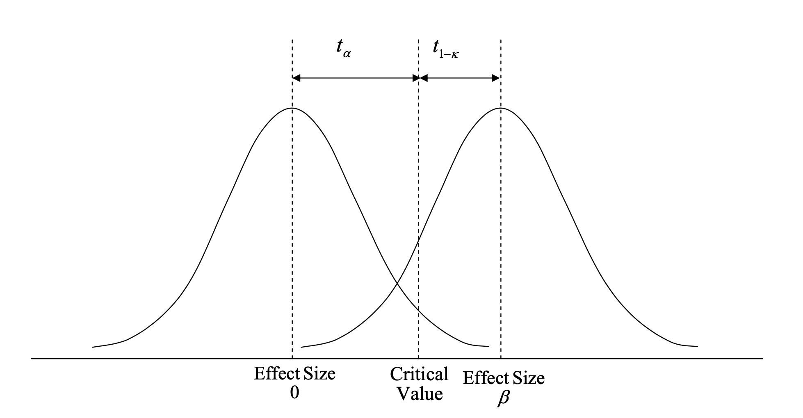

# Power {#sec-power}

Power is the probability that we reject the null hypothesis if it is false. It is a key component of experiment design because it determines the required sample size, which helps us determine how long we need to run an experiment for.

In this section, I want to do the following:

- Derive the formula for power from first principles.

- Discuss implications of the formula for a number of experiment design aspects.

- ...

## Power formula from first principles

Power is the probability that we reject the null hypothesis if it is false:

$$
1 - \beta = P[\text{reject } H_0 | H_0 \text{ is false}].
$$

To derive the formula for power, we thus have to start with testing proceedure
that determines whether or not we reject $H_0$.

The null hypothesis asserts that there is no difference between treatment and
control group, while the alternative hypothesis asserts that there is:

$$
\begin{align}
H_0: \te &= \te = 0 \\
H_A: \te &= \te \neq 0.
\end{align}
$$

We test the null hypothesis by constructing the test statistic

$$
Z = \frac{\tee}{\see}
$$

and reject the null hypothesis if

$$
|Z| > z_{\alpha/2},
$$

where $z_{\alpha/2}$ is the critical value of the standard normal distribution at the $\alpha/2$ percentile. We thus reject $H_0$ if

$$
|\tee| > \see z_{\alpha/2}
$$

The power of the test if $H_A$ is true is the probability that the test
statistic falls into the rejection region, which is:

$$
1 - \beta = P\left[|\tee| > \see z_{\alpha/2}\right].
$$

The test statistic falling into the lower or upper rejection region are mutually
exclusive events, so the above is equal to

$$
1 - \beta = P\left[\tee > \see z_{\alpha/2}\right]
+ P\left[\tee < -\see z_{\alpha/2}\right].
$$

Standardising, using the assumption that $H_A$ is true, we get

$$
1 - \beta = P\left[\frac{\tee - \te}{\see} > \frac{\see z_{\alpha/2} - \te}{\see}\right]
+ P\left[\frac{\tee - \te}{\see} < \frac{- \see z_{\alpha/2} - \te}{\see}\right], 
$$

which, using the standard normal CDF, $\Phi(z)$, we can rewrite as

$$
1 - \beta = \left[1 - \Phi\left(z_{\alpha/2} - \frac{\te}{\see}\right)\right]
+ \left[\Phi\left(-z_{\alpha/2} - \frac{\te}{\see}\right)\right].
$$

<!--
TODO
Explain why we standardise using the assumption of H_A true (it's because
we want to calculate p value falling to right of critical value if HA is true,
visualise this using the Bloom picture)
-->

For a true positive effect, the propability that we reject $H_0$ because our
test statistic falls below the lower critical value is very small, and similarly
for a true negative effect. Hence, as the true effect size deviates from zero, one of the two terms in the expression above becomes vanishingly small and can be ignored. For the rest of this chapter, I assume we have a true positive effect and omit the second of the two terms. We thus have:

$$
1 - \beta = 1 - \Phi\left(z_{\alpha/2} - \frac{\te}{\see}\right).
$$

For a simple experiment with two variants with equal population variance, the
estimated standard error of the treatment effect is given by (see @sec-experiment-stats) 

$$
\see = \seefe = \seefep
$$

where: $\sev$ is the pooled estimator of the population variance, $\Nt$ and $\Nc$ are the number of units in the treatment and control groups, respectively, $\N = \Nt + \Nc$ is total sample size, and $P$ is the proportion of units in the treatment group.

For such an experiment, the power is thus given by

$$
\begin{align}
1 - \beta &= 1 - \Phi\left(z_{\alpha/2} - \frac{\te}{\seefep}\right) \\
&= 1 - \Phi\left(z_{\alpha/2} -
\frac{\te}{\sev}\frac{1}{\sqrt{\frac{1}{P(1-P)N}}}\right) \\
&= 1 - \Phi\left(z_{\alpha/2} -
\frac{\te}{\sev}\sqrt{P(1-P)N}\right) \\
\end{align}
$$

## Theory

- Largely based on @duflo2007randomization

Power basics

- In the simplest possible, we randomly draw a sample of size $N$ from an identical population, so that our observations can be assumed to be i.i.d, and we allocate a fraction $P$ of our sample to treatment. We can then estiamte the treatment effect using the OLS regression

$$ y = \alpha + \beta T + \epsilon$$

- where the standard error of $\beta$ is given by $\sqrt{\frac{1}{P(1-P)}\frac{\sigma^2}{N}}$.

- std error derivation (from standard variance result of two independent samples, using population fractions):

$$
std = \sqrt{\frac{\sigma^2}{N_t} + \frac{\sigma^2}{N_c}} = \sqrt{\frac{\sigma^2}{PN} + \frac{\sigma^2}{(1-P)N}} = ... = \sqrt{\frac{1}{P(1-P)}\frac{\sigma^2}{N}}
$$

- The distribution on the left hand side below shows the distribution of our effect size estimator $\hat{\beta}$ if the null hypothesis is true.

- We reject the null hypothesis if the estimated effect size is larger than the critical value $t_{\alpha}$, determined by the significance level $\alpha$. Hence, for this to happen we need $\hat{\beta} > t_{\alpha} * SE(\hat{\beta})$ (follows from rearranging the t-test formula).

- On the right is the distribution of $\hat{\beta}$ if the true effect size is $\beta$.

- The power of the test for a true effect size of $\beta$ is the area under this curve that falls to the right of $t_{\alpha}$. This is the probability that we reject the null hypothesis given that it is false.

- Hence, to attain a power of $\kappa$ it must be that $\beta > (t_a + t_{1-\kappa}) * SE(\hat{\beta})$, where $t_{1-\kappa}$ is the value from a t-distribution that has $1-\kappa$ of its probability mass to the left (for $\kappa = 0.8$, $t_{1-\kappa} = 0.84$).

- This means that the minimum detectable effect ($\delta$) is given by:

$$ \delta = (t_a + tq_{1-\kappa}) * \sqrt{\frac{1}{P(1-P)}\frac{\sigma^2}{N}} $$

- Rearranding for the minimum required sample size we get:

$$ N =  \frac{(t_a + t_{1-\kappa})^2}{P(1-P)}\left(\frac{\sigma}{\delta}\right)^2 $$

- So that the required sample size is inversely proportional to the minimal effect size we wish to detect. This makes sense, it means that the smaller an effect we want to detect, the larger the samle size we need. In particular, given that $N \propto \delta^{-2}$, to detect an effect of half the size we need a sample four times the size.

- SE($\beta$) also includes measurement error, so this is also a determinant of power.

## What determines power

- Significance level

- Effect size

- Standard error

    - Sample size

    - Variant allocation proportion

    - Metric variance

## How to increase power

- Power can be increased trivially by lowering the significance level, which we often don't want to do, or by increasing sample size, which we're often trying to avoid.

- Increase effect size

  - Ensure that only users who are exposed to the change are in the data to avoid dilution of the effect

- Optimally allocate variance proportions

  - Usually equal for highest power

  - Show why with many treatment variants, higher share in control is better

- Reduce metric variance
  
  - Choose metric with low variance (e.g. indicator)
  
  - Use variance reduction technique
  
  - Only include triggered users

## How to choose key parameters

### MDE

- What are you balancing here? The size of the effect you are able to identify and the time it takes to do it.

- All else equal, the smaller a change you want to be able to detect, the longer it will take for the experiment to run because you need more sample size.

- The relevant question to ask here is "what counts as a practically relevant change?"

- To answer that, consider:

  - Maturity of service (the more mature, the smaller a change can be expected)

  - Size of service (the larger, the smaller a change still generates a lot of revenue)

  - Cost of change that need ot be covered

    - Cost of fully building out feature for launch (can be 0 when fully built out for experiment or high if we use painted door)

    - Cost of maintaining new code (new code has higher bugs, may increase code complexity and maintenance)

    - Other costs: e.g. does CPU utilization increase?

### Significance level

- What are you balancing here? The probabilities of making a type I and type II error.

- The higher significance level, the less likely we are to implement useless features (to make a Type I error) but the more likely we are to no implement useful features (to make a Type II error).

- Hence, gotta balance cost of implementing useless feature and cost of not implementing useful feature.

- Things that play into this:

  - How long will feature be in effect (less long lowers risk of implementing)?

  - How widely will it be deployed (less widely lowers risk of implementing)?

  - How many users will see it / where in the funnel is it (later in funnel lowers risk of implementation)

- What to do in practice:

    - Start from baseline values ($alpha = 0.05$)

    - Adjust depending on balance of risks

### Power

- What are you balancing here? The risk of making a Type II error and the time you have to wait for your results.

- All else equal, the higher a level or power you want, the longer you'll have to run the experiment to accumulate the requried sample size.

- Factors to consider:

  - How costly is it to not implement a useful feature.

## Problems with low power

- Truth inflation: underpowered studies only find a significant effect it the effect size is larger than the true effect size, leading to inflated claims of effect sizes.

## Power in online experiments

- @kohavi2014seven point out (in rule 7) that while general advice suggets that the CLT provides a good approximation for n larger than 30, the large skew in online metrics often requires many moer users. They recomment 355 * (skewness coefficient)^2.

## Rule of thumb for sample size

For alpha = 0.05, power = 0.8, and a two-sided test with equal allocation to two variants, required sample size is approximately:

$$
n \approx \frac{16\sigma^2}{\tau^2},
$$

where $\sigma^2$ is the sample variance and $\tau$ is the tretment effect (this is not known, but we can use the MDES).

## Best practices

- When aiming to estimate a precise effect size rather than just being interested in statistical significance, use assurance instead of power: instead of choosing a sample size to attain a given level of power, choose sample size so that confidence interval will be suitably narrow 99 percent of the time ([Sample-Size Planning for More Accurate Statistical Power: A Method Adjusting Sample Effect Sizes for Publication Bias and Uncertainty](https://www3.nd.edu/~kkelley/publications/articles/Anderson_Kelley_Maxwell_Psychological_Science_2017.pdf) and [Understanding the new statistics](https://tandfbis.s3.amazonaws.com/rt-media/pp/common/sample-chapters/9780415879682.pdf).)

## Useful resources

- @larsen2023statistical for general overview
- @zhou2023all for comprehensive overview of how to calculate power
- @bojinov2023design, section 5, for simulation results for switchbacks and generally good approach to simulation to emulate
- @reich2012empirical power calcs for cluster-randomised experiments

[^mutuallyexcl] We can simply dd up the probability of the test statistic falling into the
upper and lower tail because the two events are independent.

## Q&A

Questions:

1. Longer experiment duration generally increases power. Can you think of a scenario where this is not the case?

2. An online shopping site ranks products according to their average rating. Why might this be suboptimal? What could the site do instead?

Answers:

1. When using a cumulative metric such as number of likes, the variance of which will increase the longer the experiment runs, which will increase the standard error of our treatment effect estimate and lower our power. Remember that $SE(\hat{\tau}) = \sqrt{\frac{1}{P(1-P)}\frac{\sigma^2}{N}}$. So, whether this happens depends on what happens to $\frac{\sigma^2}{N}$, as experiment duration increases. A decrease in power is plausible -- likely, even! -- because $N$ will increase in a concave fashion over the course of the experiment duration (some users keep coming back), while $\sigma^2$ is likely to grow faster than linearly, which causes the ratio to increase and power to decrease. 

2. The approach is suboptimal because products with few ratings will have much more variance than products with many ratings, and their average rating is thus less reliable. The problem is akin to small US states having the highest *and* lowest rates of kidney cancer, or small schools having highest *and* lowest average pupil performance. Fundamentally, it's a problem of low power -- the sample size is too low to reliably detect a true effect. The solution is to use a shrinkage method: use a weighted average of the product average rating and some global product rating, with the weight of the product average rating being proportional to the number of ratings. This way, products with few ratings will be average, while products with many ratings will reflect their own rating.
